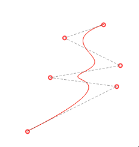
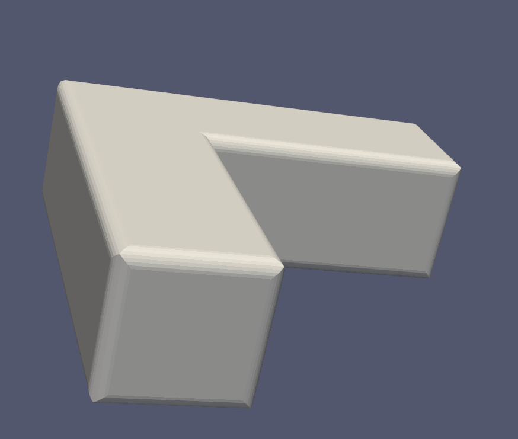
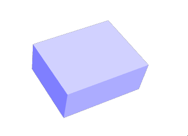
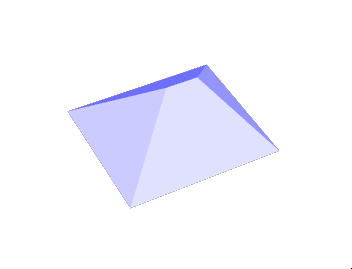
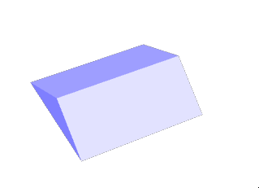
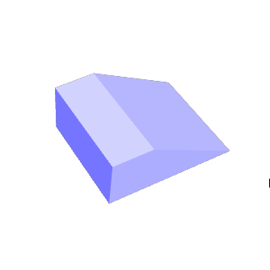
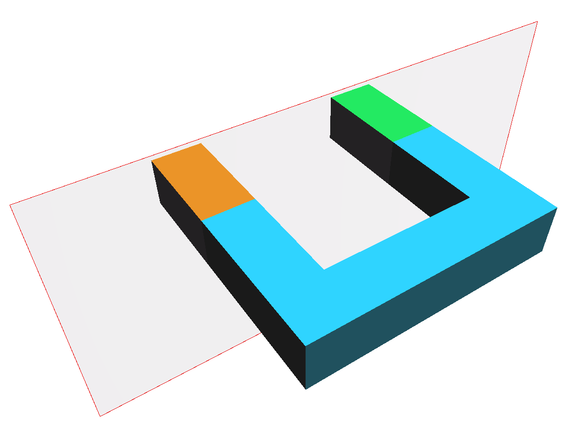

# Changelog SFCGAL 2.3.0 (2026-06-12)

## Geometries

### Primitives

Already available in previous version: Cylinder/Sphere via Buffer3D. Version 2.3.0 adds a dedicated framework for all primitives.
The available primitives are now:

- Cylinder
- Sphere
- Box
- Cube
- Frustum
- Torus

Contributors: Jean Felder, Jacky Volpes
Sponsored by: Frankfurt

### Nurbs

An initial version of curve integration using NURBS is now available.

Note:
The API and code should be considered as unstable.

Contributors: Loïc Bartoletti, Jean Felder
Sponsored by: Frankfurt, Oslandia

## CLI sfcgalop

`sfcgalop` is a command-line utility for executing SFCGAL operations, similar to `geosop` for GEOS.
It is used internally to test and prototype processing tasks or to visualize results with various external tools.
It allows you to:
- Read, write, and convert geometries (WKT, WKB, JSON, OBJ, STL, VTK); there are no plans to do more
- perform SFCGAL processing
- create 2D or 3D geometries/primitives

It can be enabled via CMake with `-DSFCGAL_BUILD_CLI=ON`

Note:
Even though it is similar to geosop, there is no guarantee of 100% compatibility. Furthermore, it is not yet possible to perform comprehensive benchmarks and comparisons due to differences in kernel types and supported platforms.

Contributors: Loïc Bartoletti, Jean Felder, Raphael Delhome, ...
Sponsored by: Oslandia

## Algorithms

### Chamfer/fillet

SFCGAL introduces a new algorithm for creating 3D chamfers and fillets. A fillet is a discretization of a chamfer.
This is a construction process: you first create the material to be removed, then apply a 3D Boolean operation.

Note:
The API and code should be considered as unstable.

Contributors: Loïc Bartoletti, Jean Felder
Sponsored by: Frankfurt

### Equality

Add new `almostEqual` mechanism with flags to combine to specify :

* the kind of check: point by point or cover
* if sub geometries or sub parts need to be ordered
* if sub geometry points need to be ordered or shifted or inverted

Contributors: Loïc Bartoletti, Benoit De Mezzo
Sponsored by: Oslandia

### Polygon Repair

Polygon repair is a 2D polygon repair algorith. It uses several repair rules:

- Even/odd (requires CGAL 6.0+)
- Non zero (requires CGAL 6.1+)
- Union (requires CGAL 6.1+)
- Intersection (requires CGAL 6.1+)

More informations on [CGAL package](https://doc.cgal.org/6.1.2/Polygon_repair/)

Sponsored by: Oslandia

### Roof / straight skeleton

The improvement of the straight skeleton algorithm in SFCGAL has also made it possible to develop roof-generation algorithms.

In addition to the new straight skeleton modes from CGAL, it is now possible to generate the following roof types from a polygon footprint:

- flat roof (simple extrusion)
- hipped roof (classical straight skeleton extrusion)
- gable roof (with horizonal ridge)
- skillion roof ()

Sponsored by: Frankfurt

### Surface simplification

Optional dependency: eigen3

Surface simplification through CGAL edge collapsing. Three simplification strategies have been implemented (edge length, Lindstrom-Turk, Garland-Heckbert, the last two require the Eigen support).

One may decimate PolyhedralSurface or TIN by considering an edge amount target or an edge ratio.

[Surface simplification screencast](https://gitlab.com/-/project/20131823/uploads/9bece367cc2b07ff9931b24632a7abd7/Capture_vid%C3%A9o_du_2026-04-15_15-50-55.mp4)

Contributors: Loïc Bartoletti, Raphaël Delhome
Sponsored by: NlNet

### Topology preservation

Result of algorithm (like straight skeleton) were fully triangulated but now they can be simplified while preserving topology.

Contributors: Jean Felder
Sponsored by: Oslandia

### Split 3D

Splits a geometry using a plane defined by a point and a normal vector, based on CGAL::PMP::split algorithm.

Supported types: TIN, PolyhedralSurface, Solid. The result is a GeometryCollection of the split parts.

Contributors: Jean Felder
Sponsored by: Frankfurt

## New I/O formats

- GeoJSON reader/writer (Sponsored by: Loïc Bartoletti)
- OBJ reader (Sponsored by: NlNet)
- fix WKB for Solid (Sponsored by: Oslandia)

## Chores

### CGAL support

SFCGAL 2.3.0 is the last version to support CGAL 5. The next version of SFCGAL (3.x) will only support CGAL 6.

Although CGAL 6.2 is supported, we recommend using CGAL 6.1. This is because version 6.2 of CGAL was released one day before SFCGAL 2.3.0. Our tests pass, but we have reported compilation issues on various BSD systems. It is not as thoroughly tested as CGAL 6.1

Sponsored by: Oslandia

### tooling

This version includes a number of improvements, such as better Doxygen comments, fixes via Clang-Tidy, and additional security features (ASAN, UBSAN)

Sponsored by : Oslandia

For the full list of changes, see the NEWS file or the revision comparison: https://gitlab.com/sfcgal/SFCGAL/-/compare/v2.2.0...v2.3.0
